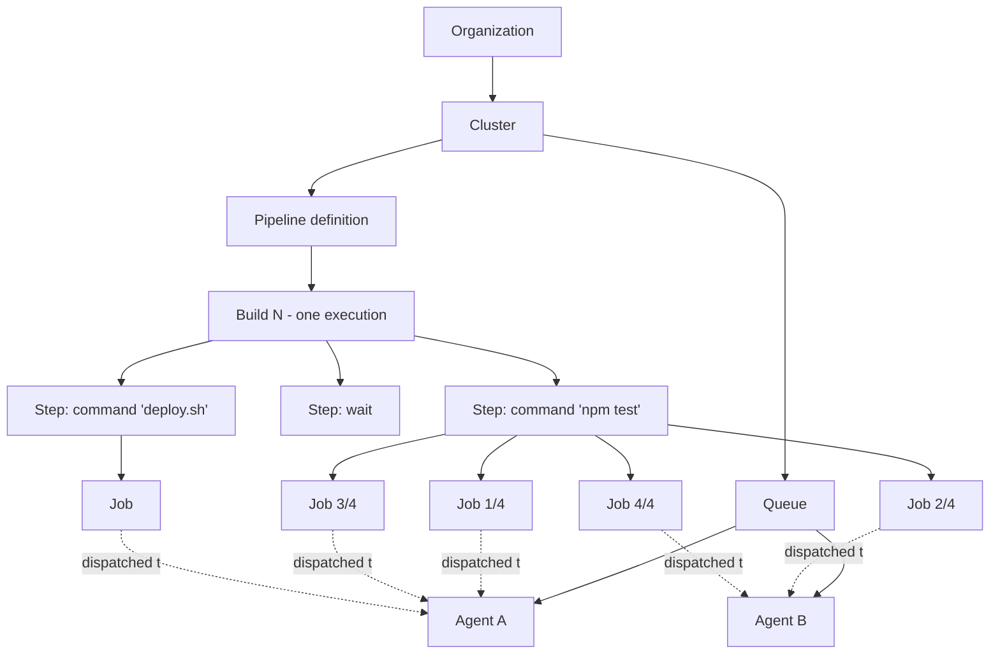

# Build Hierarchy

The containment relationship between pipeline, build, step, and job, plus the canonical state enums for builds and jobs. Use this reference when interpreting webhook payloads, REST or GraphQL responses, or any UI state.

## Diagram

The dashed lines are runtime dispatch — not part of the static definition. A step's jobs may run on any agent that matches its `agents:` tags.

## One step, many jobs

| Pipeline construct | Steps produced | Jobs produced |
|---|---|---|
| Plain `command:` step | 1 | 1 |
| Step with `parallelism: 10` | 1 | 10 |
| Step with `matrix:` over 3 x 2 dimensions | 1 | 6 (minus any `skip: true` adjustments) |
| `group:` with 3 nested command steps | 1 group + 3 nested = 4 | 3 (the group itself has no job) |
| `wait` step | 1 | 0 (no job — it is a synchronization barrier) |
| `block` step | 1 | 0 until unblocked; 1 when unblocked |

## Build states

Builds have a single state enum, surfaced on `build.state` in webhooks and `state` on REST `GET /builds/:uuid`.

| State | Meaning |
|---|---|
| `scheduled` | Build accepted; jobs not yet running |
| `running` | At least one job has started |
| `passed` | All jobs reached a passing outcome |
| `failed` | At least one required job failed |
| `canceled` | Build was canceled before completion |
| `blocked` | A `block` step is waiting for unblock |
| `not_run` | Build was skipped (e.g. `[skip ci]`, branch filter) |

## Job states and outcomes

Jobs carry both a `state` (lifecycle position) and an `outcome` (terminal result). The two are different — a job in state `finished` may have outcome `passed`, `failed`, or `soft_failed`.

| Job `state` | Meaning |
|---|---|
| `pending` | Created but not yet eligible for assignment |
| `waiting` | Waiting on an earlier step or `depends_on` |
| `blocked` | A block step ahead of it has not been unblocked |
| `scheduled` | Eligible for assignment to an agent |
| `assigned` | Dispatched to a specific agent |
| `accepted` | Agent acknowledged the job |
| `running` | Command is executing |
| `canceling` | Cancellation requested, not yet acknowledged |
| `canceled` | Cancellation completed |
| `timing_out` | Timeout exceeded, agent being asked to stop |
| `timed_out` | Timeout completed |
| `finished` | Terminal — see `outcome` for the result |
| `skipped` | Conditional check (`if`, `if_changed`) excluded the job |
| `broken` | Job could not be created (config error, infrastructure failure) |

| Job `outcome` | Meaning |
|---|---|
| `passed` | Command exited 0 |
| `failed` | Command exited non-zero or agent reported failure |
| `soft_failed` | Command exited non-zero, but step config marked it non-blocking |

## Reading state correctly

- The REST and GraphQL APIs are the source of truth. Webhooks are eventually consistent — `build.finished` can arrive while child jobs are still settling.
- An infrastructure failure (agent lost, image pull failure, OOM kill) typically surfaces as job state `broken` or outcome `failed` with a non-zero exit status set by the agent. The dedicated infra-versus-test failure distinction has historically required reading `exit_status` and matching against well-known codes; the planned `failure_reason` field will surface this directly in future API responses.
- A build can be `passed` while individual jobs are `soft_failed`. Treat `outcome` not `state` as the success signal for individual jobs.
