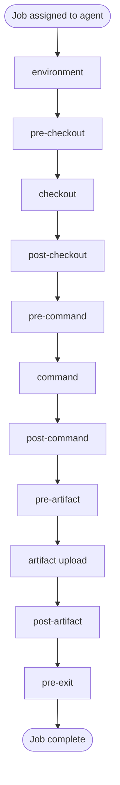

# Hooks Lifecycle

Buildkite agents run scripts at defined points during job execution. This reference names every hook, shows the firing order, and notes the directory each lives in. Conceptual only — hook authoring belongs to the **buildkite-agent-infrastructure** skill.

## Order of execution

If any hook before `command` fails, the job is failed and execution jumps to `pre-exit`. The `pre-exit` hook always runs, even on failure or cancellation — use it for cleanup that must happen unconditionally.

## Hook table

| Hook | When it fires | Common use |
|---|---|---|
| `environment` | First, before checkout | Set or rewrite env vars, fetch secrets, validate prerequisites |
| `pre-checkout` | Before the source code is checked out | Mirror or proxy git operations, clean prior workspace |
| `checkout` | Replaces the default git checkout | Custom checkout strategies (sparse, partial, monorepo) |
| `post-checkout` | After checkout completes | Inspect the working tree, run codegen, install local tools |
| `pre-command` | Right before the step's `command` runs | Last-mile setup; debug env state with `buildkite-agent env dump` |
| `command` | The step's main work | Rarely overridden by an agent-level hook |
| `post-command` | After `command` finishes | Collect logs, format reports |
| `pre-artifact` | Before `artifact_paths:` upload | Filter or transform artifacts |
| `artifact` | Replaces the default artifact upload | Custom storage backends |
| `post-artifact` | After artifact upload completes | Cross-link artifacts in annotations |
| `pre-exit` | Final, always runs | Cleanup, finalizers, conditional pipeline upload on failure |

## Hook sources

Hooks resolve in this order, with later sources overriding earlier ones for the same hook name:

1. **Agent hooks** — `~/.buildkite-agent/hooks/<hook-name>` on the agent host. Apply to every job that agent runs.
2. **Plugin hooks** — `hooks/<hook-name>` inside each plugin pulled in by the step's `plugins:` block.
3. **Repository hooks** — `.buildkite/hooks/<hook-name>` in the checked-out repository. Apply to every step in that repository's pipeline.

For agents running on Kubernetes via `agent-stack-k8s`, the resolution order can interact with pod lifecycle in non-obvious ways — verify hook execution in a real build before relying on it.

## What this reference does not cover

- The authoring API for hooks (shell semantics, exported variables, sourced vs executed) — see **buildkite-agent-infrastructure**.
- The `buildkite-agent.cfg` keys that disable or restrict hooks — see **buildkite-agent-infrastructure**.
- Plugin hook contracts (what each plugin guarantees) — see the individual plugin's README.

The purpose of this file is to name every lifecycle position so an agent reading a SKILL.md or a log can identify which hook produced which output.
